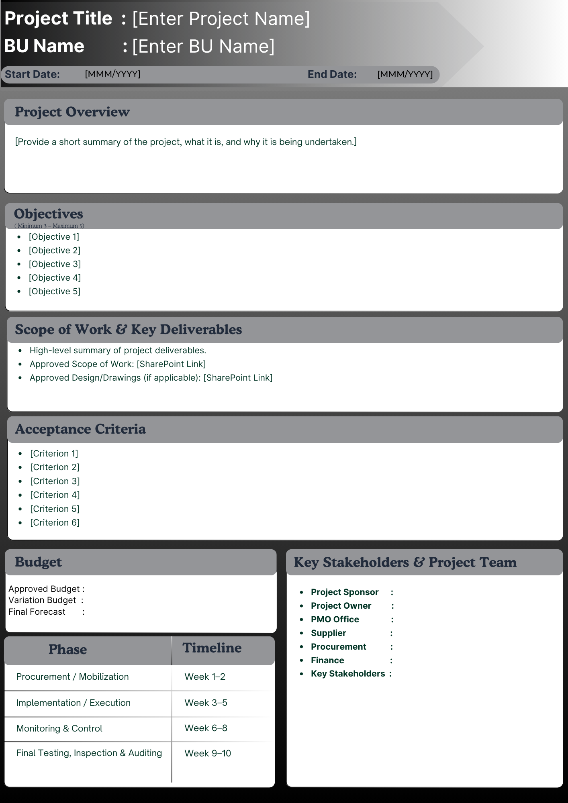
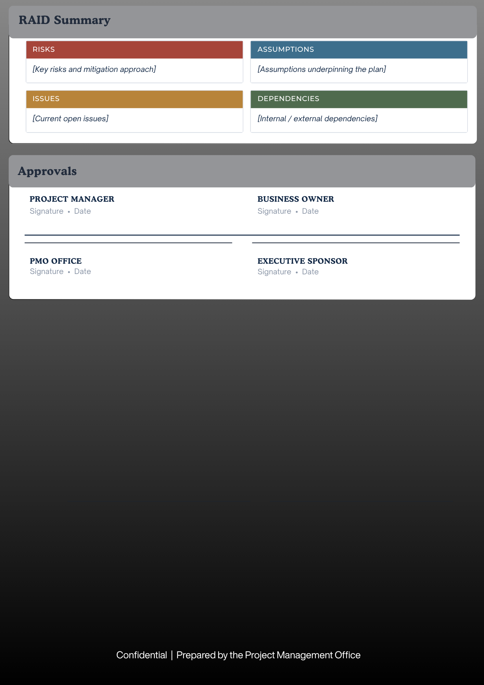

# 📋 Enterprise Project Charter Template

A professional **Enterprise Project Charter Template** designed for PMO teams, Project Managers, Programme Managers, and Transformation Offices.

This template follows PMO governance best practices and provides a structured approach for initiating projects, defining objectives, documenting scope, identifying stakeholders, planning timelines, and obtaining executive approvals.

---

## ✨ Features

- Executive Project Overview
- Project Objectives
- Scope of Work & Key Deliverables
- Acceptance Criteria
- Budget Summary
- Project Timeline
- Key Stakeholders & Project Team
- RAID Summary (Risks, Assumptions, Issues & Dependencies)
- Executive Approval Section

---

## 📄 Download

Download the template here:

**📄 PMO-Project Charter.pdf**

---

## 🖼 Preview

### Page 1

### Page 2

---

## 🎯 Suitable For

- PMO Offices
- Project Managers
- Programme Managers
- Portfolio Managers
- Digital Transformation Projects
- IT Projects
- Construction Projects
- Facilities Management Projects

---

## 📌 Version

**Version:** 1.0

---

## 📜 License

This template is provided for learning, portfolio, and professional reference purposes.
